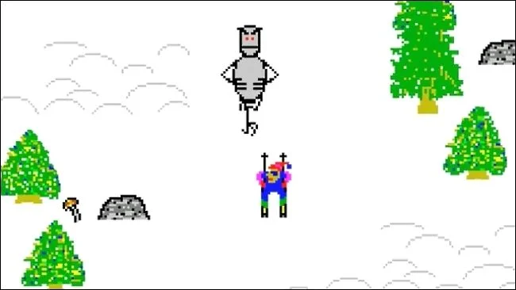

A Ski Free Game using Javascript and Kaboom.js 	🎆.
Kaboom is a JavaScript library that helps you make games fast and fun 🤓.
In Kaboom, each game object is composed from multiple components. Each component will give the game obj certain functionality.

## Description:
This is a spinoff of the classic retro game Ski Free, where the player navigates a skier down a slope and around obstacles. Random monsters pop up and try to eat player.Game is currently designed to play against the computer.

 

## Tech Stack:
- Javascript
- Kaboom.js
- HTML
- CSS
 
 

## Upcoming Features:
- Going to add more levels that get harder/different obstacles.
- Player will be able to select their character at the begining of the game.
- Better styling and background.

## Resources:

https://www.youtube.com/watch?v=u5aD3lHrAaQ&t=2s

https://kaboomjs.com

https://www.youtube.com/c/Frankslaboratory

Orginal Game:
https://mini-skifree-tutorial.sdepaula97.repl.co/
